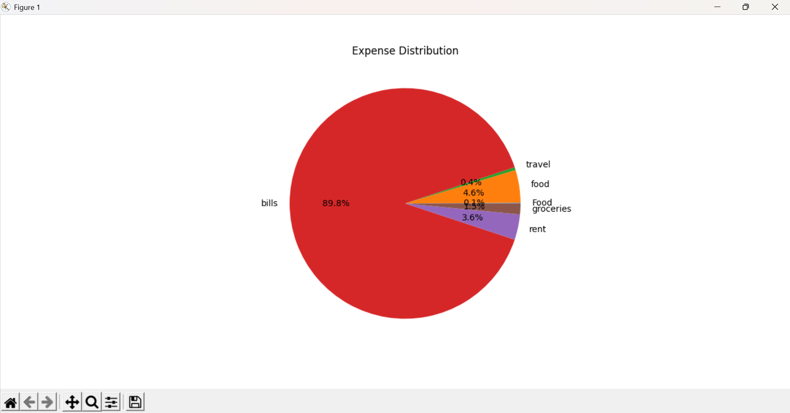

# 💰 Smart Expense Tracker (CLI-Based)

## 📌 Project Overview

Smart Expense Tracker is a Python-based Command Line Interface (CLI) application developed to help users manage and track their daily expenses efficiently. The project stores expense records in a CSV file and provides basic expense analysis features such as monthly summaries, category-wise spending analysis, highest spending category detection, and graphical visualization using pie charts.

---

## 🚀 Features

- Add daily expenses
- View all saved expenses
- Store data using CSV files
- Generate monthly expense summaries
- Category-wise expense breakdown
- Detect highest spending category
- Expense visualization using pie charts
- Simple CLI-based interaction

---

## 🛠️ Technologies Used

- Python
- CSV File Handling
- Matplotlib

---

## 📸 Screenshots

### 💻 CLI Menu


### 📊 Expense Distribution Pie Chart



---

## ▶️ How to Run the Project

### 1️⃣ Install Required Library

```bash
pip install matplotlib
```

### 2️⃣ Run the Application

```bash
python main.py
```

---

## 📂 Project Structure

```text
Smart-Expense-Tracker/
│
├── main.py
├── expenses.csv
├── requirements.txt
├── README.md
├── cli.png
└── chart.png
```

---

## 📊 Functionalities

The application allows users to:

- Record and save expenses
- Categorize expenses such as Food, Travel, Bills, etc.
- View complete expense history
- Analyze monthly spending
- Identify highest spending categories
- Visualize spending distribution using pie charts

---

## 👨‍💻 Author

**Vivek Gupta**
